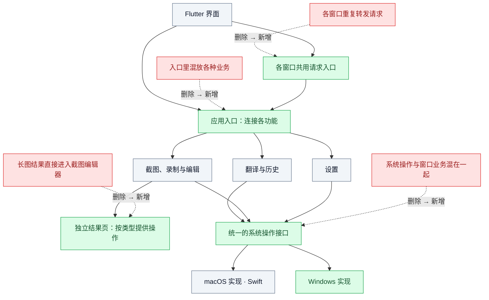

# 跨平台架构优化交接

面向接手开发的同事。目标：新增功能少改公共代码，接入 Windows 时复用界面和业务。保留 Flutter/Dart 与 macOS Swift；Windows 增加原生实现，不整体重写。

本文是已确认方向的实施交接，不表示改造已经完成。最新代码核对基线为 `17f20c3`（长截图改为保留页并升至 2.0.0）；接手先核对最新差异。未验证性能收益，不将架构调整视为长截图闪退的已证实修复。

## 已有进展与剩余工作

1. **已提交实现：** `17f20c3` 中长图通过采集结果窗口显示，提供保存、复制、放弃，不再交给截图编辑器。系统关闭与放弃共用清理路径，已保存文件保留。相关本地规格和自动化测试用例已包含在提交中；不要重复开发该页面。本次只读核验没有重新运行测试，也未确认用户验收或 GitHub 同步状态。
2. **仍需整理：** 结果文件目前仍由采集会话持有。先核验采集资源是否已经释放、关闭与再次采集是否正确，再决定是否需要进一步拆分；不为凑图新增空壳对象。
3. **后续优化：** 入口业务归属、重复窗口路由、平台接口与 Windows 接入。本次核对时工作区未提交项为本交接文档及目录索引；接手仍应先核对全部差异，不覆盖或回退他人修改。

## 一图看懂改什么

灰色保留，红色删除，绿色新增。虚线表示替换关系；红色节点代表职责组织方式，不代表删除对应产品能力。图展示相对于 `96efed4` 的目标改造，其中独立长图结果页已在 `17f20c3` 实现。

图中“共用请求入口”只处理跨窗口请求；同一个 Dart 引擎内直接调用所属功能，不绕行通道。“系统操作接口”是一组小接口，不是新增万能管理器。

## 分工与实际收益

| 部分 | 应负责什么 | 优化点 |
| --- | --- | --- |
| 应用入口 | 创建各模块、连接窗口与功能 | 不继续堆积翻译、历史、设置处理逻辑 |
| 翻译与历史 | Provider、会话、分段、重试、取消、历史存储 | 新协议集中在翻译模块 |
| 媒体 | 采集操作流程、编辑文档、完成结果、保存规则 | 新采集方式无需依赖截图编辑器 |
| 设置 | 配置模型、校验、唯一提交入口 | 窗口不各自保存一套业务配置 |
| 平台实现 | 选区、快捷键、权限、窗口、采集、编码、凭据 | Windows 补系统实现，复用 Dart 界面与业务 |

保持按功能组织目录，不为每个功能增加 Controller、Service、Repository 等固定层级。现有 Provider、编辑文档、历史存储、拼接和编码实现优先保留。

## 必须守住的规则

1. **同一状态只有一个决定者。** Dart 管翻译会话、设置提交、历史、编辑文档；原生采集会话管屏幕流、编码器和采集阶段。界面接收快照，不另建采集状态机。
2. **窗口不是业务所有者。** 窗口关闭发出明确命令，由所属功能清理资源。窗口控制器不相互调用来完成业务交接。
3. **采集与结果分开。** 采集结束产生文件引用、类型、尺寸和可选时长；结果接管临时文件后，采集释放流和编码器。交接失败不能先删除文件。
4. **结果与编辑分开。** 长图结果提供保存、复制、放弃；视频结果提供播放、保存、GIF 导出、放弃。结果展示不自动创建裁剪、标注会话。
5. **保存和放弃语义明确。** 放弃清理当前临时结果，已保存文件保留；重复关闭不得重复释放导致错误。
6. **高频数据留在原生。** 视频帧直接进入原生编码链路；跨语言传命令、状态和文件引用，不来回搬运视频帧。
7. **平台差异显式返回。** 未支持的系统能力明确报告，不用空实现假装成功；平台判断集中在装配和平台实现处。
8. **多窗口不复制业务。** 历史库和设置入口保持唯一。先收敛装配、路由，不预设必须减少 Flutter 引擎数量。

## 接手入口

| 文件 | 重点检查 |
| --- | --- |
| [lib/main.dart](../lib/main.dart) | Provider 创建、设置事务、历史查询、跨引擎分发的归属 |
| [MacPlatformBridge.swift](../macos/Runner/MacPlatformBridge.swift) | 系统能力与内部业务转发的区分 |
| [SettingsWindowController.swift](../macos/Runner/SettingsWindowController.swift)、[AuxiliaryWindowController.swift](../macos/Runner/AuxiliaryWindowController.swift) | 重复的引擎装配与请求转发 |
| [CaptureWindowController.swift](../macos/Runner/CaptureWindowController.swift)、[MediaCaptureService.swift](../macos/Runner/MediaCaptureService.swift) | 采集、结果交接、关闭、临时文件释放 |
| [ScreenshotWindowController.swift](../macos/Runner/ScreenshotWindowController.swift) | 截图选择与编辑职责，不承接长图结果生命周期 |
| [capture_app.dart](../lib/src/capture/capture_app.dart)、[edit_document.dart](../lib/src/screenshot/edit_document.dart) | 结果展示与编辑状态的区分 |

## 执行顺序

每一步单独形成可检查的改动；不要一边改架构一边重写算法。

| 顺序 | 工作 | 完成标准 |
| --- | --- | --- |
| 0 | 核对未提交修改与现有规格，记录已有进展；同步受影响 Spec | 不覆盖他人修改、不重复实现；规格与实施范围一致 |
| 1 | 核验已有独立结果页，补齐采集、完成产物、编辑的所有权约定 | 长图结束后可保存、复制、放弃；无需进入编辑器；连续采集与关闭后资源正确释放 |
| 2 | 将入口中的业务归还所属模块，收敛附属窗口请求入口 | 同类新窗口无需复制业务转发表；设置、历史仍由唯一入口处理 |
| 3 | 整理平台接口，明确输入、返回、错误、取消、会话身份 | Dart 业务不依赖 macOS 专用窗口对象；过期会话请求不能影响新采集 |
| 4 | 实现 Windows 最小链路：快捷键→截图→编辑→保存 | 复用同一编辑文档、界面和保存规则，平台实现独立 |
| 5 | 按产品范围继续接入 Windows 选区翻译、录制、长截图 | 每项单独列出能力差异与验收结果 |

Windows 最低版本、采集与多窗口实现方式尚未确定，进入第 4 步前需要明确。Windows 原生实现语言和新依赖也未选定，不将某个具体库视为已批准方案。

## 验收与交付

1. 业务测试检查实际输入输出和状态变化：取消翻译、设置提交失败、结束采集、重复关闭、保存后放弃、过期请求；不以“下游方法被调用”作为通过依据。
2. 保存规则保持：截图目录下的 `截图/YYYY-MM-DD`、`视频/YYYY-MM-DD`、`gif/YYYY-MM-DD`；GIF 使用设置中的帧率和最大宽度，默认原宽，只缩小不放大。
3. 录制连续启动需记录第一次和后续启动的耗时、资源释放情况；只在测量后报告性能改善。
4. 窗口焦点、置顶、全屏工具栏、实际页面滚动效果由用户验收；自动化测试通过不能替代界面验收。禁止 computer-use。
5. 每次交付注明做了什么、未做什么、已知问题、测试结果；不得关闭 Issue，不把待验收写成已完成验收。

## 规格与范围

实施前阅读 [规格索引](specs/README.md)、[功能规格](specs/functional.md)、[样式规格](specs/style.md)、[架构规格](specs/architecture.md) 及 [项目规则](../AGENTS.md)。先同步受影响的本地与 GitHub Spec，再开发；本文不替代正式规格。

1. 本轮交接不授权整体重写、不新增通用插件框架、事件总线、状态框架或兼容层；不改变已确认的界面尺寸与交互。
2. 不因文件大就拆分，不删除必要校验、数据保护和可访问性支持。消除旧实现时同步调用方、测试、注释和目录索引。
3. 长图结果问题 [#88](https://github.com/1504101951/translateApp/issues/88) 与采集直接消失问题 [#89](https://github.com/1504101951/translateApp/issues/89) 分别核验；结果页完成不代表消失问题已解决。
4. 本次只提供交接文档和目录索引更新；未实施其他架构改造、Windows 接入、GitHub 规格同步或验收。
