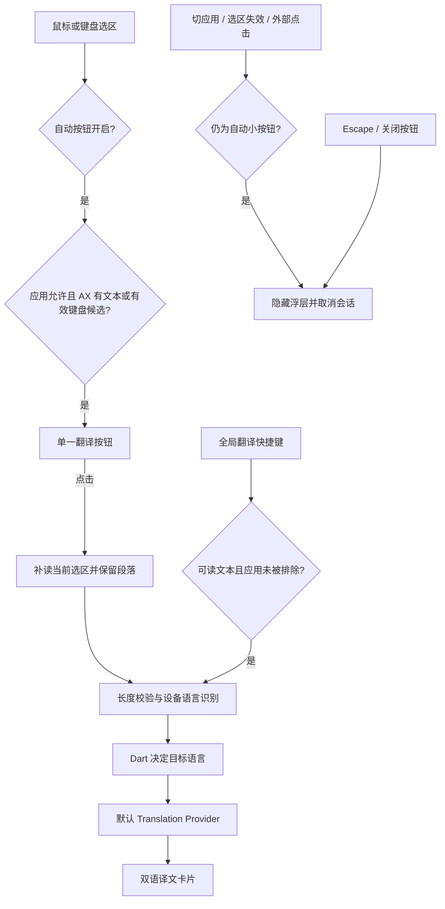

# Flutter macOS 架构

当前只交付 macOS 14+。Flutter/Dart 是应用与业务主体，Swift 负责 macOS 启动壳和系统能力。

## 职责

| Flutter/Dart | Swift |
|---|---|
| Selection Session、翻译请求与取消、语言方向、Overlay 内容、设置状态与表单 | Accessibility、鼠标与键盘监听、Carbon 热键、窗口、设备语言识别、UserDefaults、Keychain 存取、登录项 |

主 Flutter 引擎持有唯一偏好与翻译会话。设置窗口按需使用第二引擎的 `settingsMain` 入口，表单通过 `translateapp/settings` 转发到主引擎。保存请求串行处理；修订号阻止旧表单覆盖菜单更新。

## 当前翻译流程

## 窗口与会话

- 翻译窗口使用高于 floating 的 status-bar 层级，是不能成为 key/main 的非激活 NSPanel；触发态为 84×36pt 单按钮，结果态为 720×420pt 左右双栏卡片，左译文、右原文，悬停译段时高亮对应原段。
- Flutter 区分点击和拖动；译文顶部 56pt 标题区支持拖动，关闭按钮和正文在拖动命中区之外。Swift 保存本窗口原始 mouseDown 事件，Flutter 确认 pan 后将原事件交给 AppKit performDrag。同一会话保留位置，显式新翻译重新锚定。
- Swift 保存来源 PID、sessionId 及结果保留标记。Dart 激活时先发送 `retainOverlay`，再补读文字并进入翻译；保留后忽略被动失效和自动新选区，只允许 Escape/× 关闭或全局热键明确替换。旧 sessionId 的指令不能影响新会话。
- 选区、失效事件和窗口命令携带 sessionId。系统设置命令不属于选区会话，使用独立方法和设置修订号。
- 「仅使用快捷键」开启表示 automatic=false；菜单与表单均反向显示底层自动捕获状态。自动捕获关闭时保留 Escape、外部点击和前台变化监听，使快捷键产生的会话仍能正常关闭。
- 全局热键使用 RegisterEventHotKey；同一组合不重复注册，新组合注册成功后才释放旧组合。

## 服务与凭据

自动采集只读取 AX，不向来源应用注入按键。鼠标采集需要 AX 文本；Command-A 和 Shift 键盘选区可创建待确认按钮。点击翻译后携带 sessionId 补读文字；补读为空则保留失败卡片，不发送请求。全局翻译快捷键直接翻译并允许复制；网页文本通过一次性复制保留段落，随后恢复剪贴板。显式关闭或替换后的迟到结果不能提交请求。

AX 读取优先使用文本标记范围获取跨节点选区及矩形，再读取普通选中文字和字符范围；焦点窗口作为受限树查询的候选根。非文本或安全焦点控件不进入窗口搜索。

自动按钮跟踪实际提供选中文字的 AX 节点；通知合并后区分暂不可读和已确认清空。没有可读节点时不能确认键盘清空，按钮仍可通过外部点击、Escape 或切 App 结束。结果态不受这些被动验证影响，采集任务在读取前后均检查结果保留标记。

选区文本使用现有 `TranslationRequest` 进入翻译层。截图 OCR 和实时区域 OCR 按相同契约规划接入，由各入口管理采集与启停；翻译层不接收图片或录屏文件，不为尚未实施的入口建立空接口。

- 主 Dart 引擎串行处理设置保存、菜单修改和示例连接测试；修订号阻止过期表单覆盖。设置保存不关闭已展开卡片，已激活请求固定使用激活时的 Provider 和语言方向，更新供下一次翻译使用。
- `ServiceConfig` 保存服务类型、名称、Base URL、模型、独立提示词及语义对照选项；凭据独立传给 Swift，按配置 ID 存入用户 Keychain。
- 打开设置仅查询 Keychain 凭据存在状态，禁止查询触发授权 UI。保存普通配置不读取密钥；有凭据变更时 Swift 才读取对应账户的回滚快照。凭据、登录项与快捷键配置成功后才保存普通偏好；同一服务 ID 不可更换协议。
- 默认服务支持非官方 Google、Google Cloud v2、百度通用翻译、OpenAI-compatible Chat Completions、DeepSeek 与 Anthropic Messages。协议、百度签名、SSE 解析均由 Dart 实现。DeepSeek 类型及官方域名发送 `thinking.type=disabled`，段落模式另发送 `response_format.type=json_object`。
- 每个请求独占 HttpClient；取消关闭连接，请求不跟随重定向，失败信息不回显响应正文或密钥，也不自动切换服务。
- 模型段落对照一次接收全文上下文：本地按非空行分段并给出连续编号，模型仅返回各编号与完整译文。编号数量、顺序、整数类型和非空译文均需通过校验，再与本地原文配对；不使用模型回传的原文，不接受整篇高亮兜底。损坏 JSON、流中断和长度截断不算成功。
- 普通模型模式产生增量 Translation Update；语义模式在校验完成后一次发布译文和配对，避免向用户展示协议 JSON。
- Provider 使用共享的 `translateParagraphs` 保留原文分隔符并建立双语配对；普通接口顺序处理原文段落，语义模型保留整篇上下文。当前请求通过 `StreamIterator` 传播取消，失败或关闭后不处理后续段落。
- 次要语言为空时，方向仍解析为有效的主要语言；检测语言等于目标语言时，翻译层直接返回原文及段落配对。

## 后续工单

长文本分段恢复（#7）、SQLite 历史（#8）尚未实现。只在对应工单实施时新增模块，不提前建立空接口。

## 区域截图

Dart 的 `ScreenshotApp` 使用独立引擎展示内存 PNG，负责预览、自动文件名和导出操作状态。Swift 的 `ScreenshotWindowController` 调用系统区域框选，负责屏幕权限、短暂 PNG 文件清理、普通预览窗口、系统文件面板和 PNG 剪贴板。截图结果用独立 captureId 拒绝过期操作，不属于 Selection Session。

固定目录保存在 UserDefaults 的 `screenshotSaveDirectory`；用户通过目录选择器立即修改，清除后每次保存使用系统面板。ScreenshotStorage 通过拒绝覆盖的实际写入和序号处理重名。翻译与截图热键由同一 Carbon 注册事务管理，已有组合交换用途时复用注册，全部新注册成功才更新配置。

区域框选时暂停文本手势采集并隐藏翻译浮层，完成后只恢复仍有效的浮层。截图的复制与保存不经过翻译层；OCR 及统一文本请求由 #20 后续实现。
