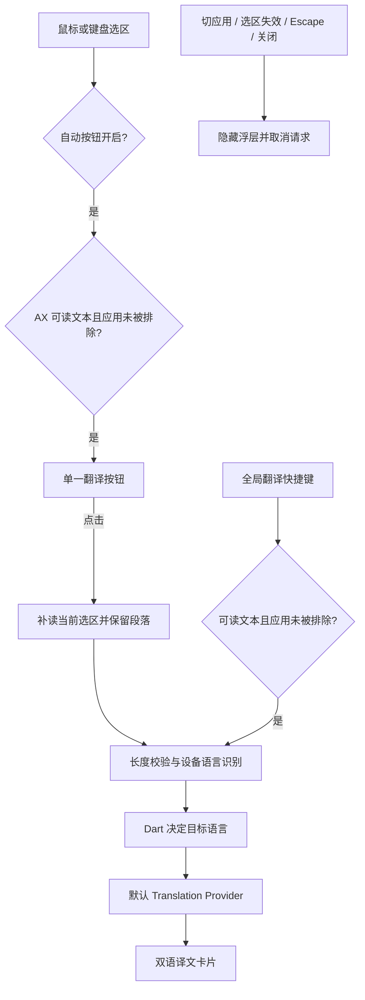

# Flutter macOS 架构

当前只交付 macOS 14+。Flutter/Dart 是应用与业务主体，Swift 负责 macOS 启动壳和系统能力。

## 职责

| Flutter/Dart | Swift |
|---|---|
| Selection Session、翻译请求与取消、语言方向、Overlay 内容、设置状态与表单 | Accessibility、鼠标与键盘监听、Carbon 热键、窗口、设备语言识别、UserDefaults、Keychain 存取、登录项 |

主 Flutter 引擎持有唯一偏好与翻译会话。设置窗口按需使用第二引擎的 `settingsMain` 入口，表单通过 `translateapp/settings` 转发到主引擎。保存请求串行处理；修订号阻止旧表单覆盖菜单更新。

## 当前翻译流程

## 窗口与会话

- 翻译窗口使用高于 floating 的 status-bar 层级，是不能成为 key/main 的非激活 NSPanel；触发态为 84×36pt 单按钮，结果态为 720×420pt 左右双栏卡片，左译文、右原文，悬停译段时高亮对应原段。
- Flutter 区分点击和拖动，Swift 使用原生鼠标事件执行拖动。同一 Session 保留位置，新 Session 重新锚定。
- Swift 保存当前来源 PID 和 sessionId，仅用于系统生命周期。失效时同步隐藏，再通知 Dart 取消 Provider 流；HTTP client 随取消关闭。
- 选区、失效事件和窗口命令携带 sessionId。系统设置命令不属于选区会话，使用独立方法和设置修订号。
- 「仅使用快捷键」开启表示 automatic=false；菜单与表单均反向显示底层自动捕获状态。自动捕获关闭时保留 Escape、外部点击和前台变化监听，使快捷键产生的会话仍能正常关闭。
- 全局热键使用 RegisterEventHotKey；同一组合不重复注册，新组合注册成功后才释放旧组合。

## 服务与凭据

自动采集只读取 AX，不向来源应用注入按键；AX 未提供文本时不创建自动会话。点击翻译时通过携带 sessionId 的 `readSelectionForTranslation` 补读当前选区，全局快捷键在采集时允许复制；网页文本通过一次性复制保留段落，随后恢复剪贴板。补读期间失效或替换的会话不能提交翻译请求。

AX 读取优先使用文本标记范围获取跨节点选区及矩形，再读取普通选中文字和字符范围；焦点窗口作为受限树查询的候选根。非文本或安全焦点控件不进入窗口搜索。

会话保存实际提供选中文字的 AX 节点。通知经过 80ms 合并后验证选区，焦点容器变化不单独使会话失效；暂不可读与已确认空选区分开处理，会话验证不触发复制。仅通过复制获取文本、没有可读 AX 节点的会话无法确认键盘清空选区，可通过外部点击、Escape 或离开来源 App 结束。

选区文本使用现有 `TranslationRequest` 进入翻译层。截图 OCR 和实时区域 OCR 按相同契约规划接入，由各入口管理采集与启停；翻译层不接收图片或录屏文件，不为尚未实施的入口建立空接口。

- 主 Dart 引擎串行处理设置保存、菜单修改和示例连接测试；修订号阻止过期表单覆盖。
- `ServiceConfig` 保存服务类型、名称、Base URL、模型、独立提示词及语义对照选项；凭据独立传给 Swift，按配置 ID 存入用户 Keychain。
- Swift 在写入前读取回滚快照；凭据、登录项与快捷键配置成功后才保存普通偏好。不存在和空字典凭据分别保留其状态。
- 默认服务支持非官方 Google、Google Cloud v2、百度通用翻译、OpenAI-compatible Chat Completions 与 Anthropic Messages。协议、百度签名、SSE 解析均由 Dart 实现。
- 每个请求独占 HttpClient；取消关闭连接，请求不跟随重定向，失败信息不回显响应正文或密钥，也不自动切换服务。
- 模型语义对照只改变展示：一次请求返回完整译文与候选源文/译文段落。应用验证原文顺序、完整覆盖和非空译文；通过时显示本地原文切片，配对无效时显示完整对照。损坏 JSON、流中断和长度截断不算成功。
- 普通模型模式产生增量 Translation Update；语义模式在校验完成后一次发布译文和配对，避免向用户展示协议 JSON。
- Provider 使用共享的 `translateParagraphs` 保留原文分隔符并建立双语配对；普通接口顺序处理原文段落，语义模型保留整篇上下文。当前请求通过 `StreamIterator` 传播取消，失败或关闭后不处理后续段落。
- 次要语言为空时，方向仍解析为有效的主要语言；检测语言等于目标语言时，翻译层直接返回原文及段落配对。

## 后续工单

长文本分段恢复（#7）、SQLite 历史（#8）尚未实现。只在对应工单实施时新增模块，不提前建立空接口。
