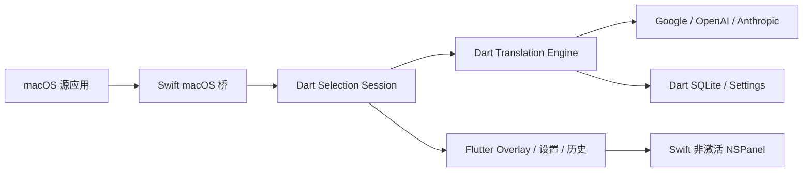
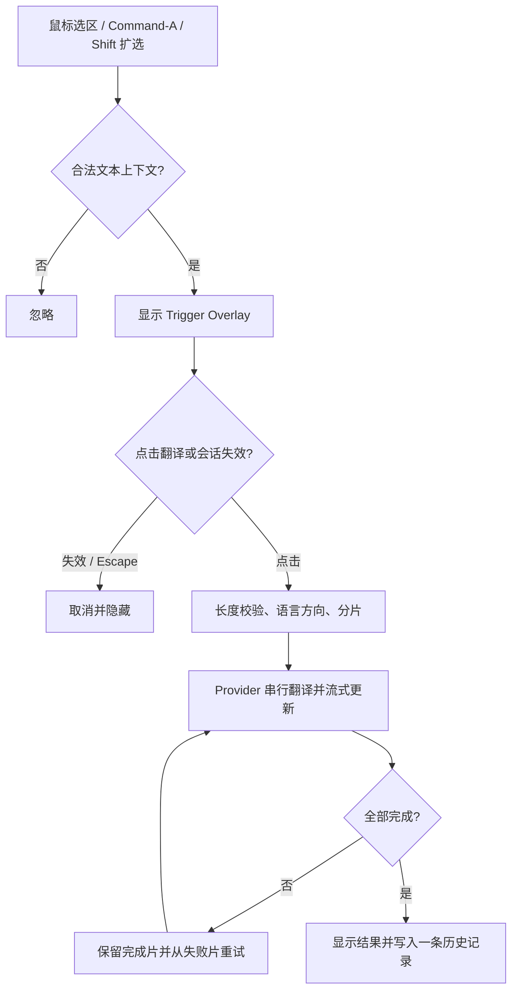

# Flutter macOS 重构架构

当前只交付 macOS 14+。Flutter/Dart 是应用与业务主体，Swift 是 macOS 启动壳和系统桥接。

## 架构图



## 翻译流程



## 职责边界

| Flutter/Dart | Swift macOS 桥 |
|---|---|
| Session、Provider、分片、流式状态、Overlay 内容、设置、SQLite | Accessibility、全局鼠标/按键、Text Selection Context、非激活 NSPanel、Keychain、登录项 |

Dart 是业务状态的唯一事实源。Swift 不保存翻译状态，不实现 Provider，不写翻译业务。

## 目录结构

```text
translateApp/
├── pubspec.yaml
├── lib/
│   ├── main.dart
│   └── src/
│       ├── platform/macos_platform_bridge.dart
│       ├── selection/
│       ├── translation/providers/
│       ├── overlay/
│       ├── settings/
│       └── history/
├── macos/Runner/
│   ├── MacPlatformBridge.swift
│   ├── AccessibilitySelection.swift
│   ├── SelectionMonitor.swift
│   └── OverlayPanel.swift
└── test/
```

只在对应 Issue 开始时创建目录和文件，不提前搭建空模块。

## 平台通道

- Swift → Dart：`selectionCaptured`、`selectionInvalidated`、权限变化、Escape。
- Dart → Swift：显示/隐藏 Overlay、权限设置、应用排除、Keychain、登录项。
- Swift `NSPanel` 原生处理拖动；同一 `sessionId` 保留位置，新 Session 重置到新选区锚点。
- 所有事件和命令携带 `sessionId`，过期 Session 的结果直接丢弃。
- Trigger Overlay 为 84×36pt 的单一翻译按钮；Result Overlay 展示译文与关闭入口。Flutter 区分点击和拖动手势，Swift 使用当前鼠标事件执行非激活窗口拖动。
- Swift 绑定来源 PID 读取选区，观察前台应用与 AX 选区变化；失效时同步隐藏窗口并发送 `selectionInvalidated`。Dart 取消 Provider 流订阅，Google Provider 随之关闭当前 HTTP 连接。

## 实施顺序

```text
#13 → #2 → (#9、#11、#12) → #10 → #3 → (#4、#5、#6) → #7 → #8
```

#13 必须先验证 Flutter 内容可在非激活 `NSPanel` 中交互，且不会抢占源应用焦点。旧 Swift Package 原型已删除，不维护兼容层。
