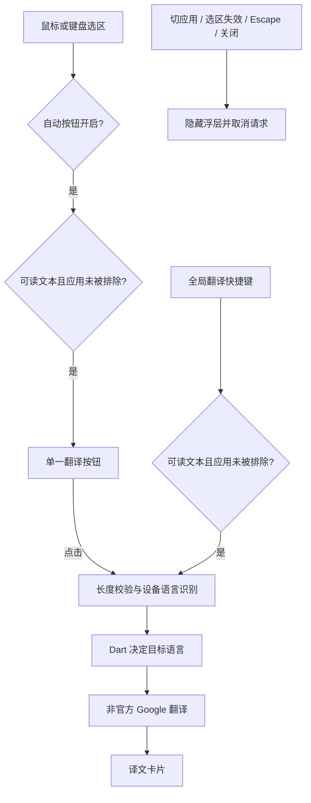

# Flutter macOS 架构

当前只交付 macOS 14+。Flutter/Dart 是应用与业务主体，Swift 负责 macOS 启动壳和系统能力。

## 职责

| Flutter/Dart | Swift |
|---|---|
| Selection Session、翻译请求与取消、语言方向、Overlay 内容、设置状态与表单 | Accessibility、鼠标与键盘监听、Carbon 热键、窗口、设备语言识别、UserDefaults 存取、登录项 |

主 Flutter 引擎持有唯一偏好与翻译会话。设置窗口按需使用第二引擎的 `settingsMain` 入口，表单通过 `translateapp/settings` 转发到主引擎。保存请求串行处理；修订号阻止旧表单覆盖菜单更新。

## 当前翻译流程

## 窗口与会话

- 翻译窗口是不能成为 key/main 的非激活 NSPanel；触发态为 84×36pt 单按钮，结果态为 380×360pt 双语卡片。
- Flutter 区分点击和拖动，Swift 使用原生鼠标事件执行拖动。同一 Session 保留位置，新 Session 重新锚定。
- Swift 保存当前来源 PID 和 sessionId，仅用于系统生命周期。失效时同步隐藏，再通知 Dart 取消 Provider 流；HTTP client 随取消关闭。
- 选区、失效事件和窗口命令携带 sessionId。系统设置命令不属于选区会话，使用独立方法和设置修订号。
- 自动捕获关闭时保留 Escape、外部点击和前台变化监听，使快捷键产生的会话仍能正常关闭。
- 全局热键使用 RegisterEventHotKey；同一组合不重复注册，新组合注册成功后才释放旧组合。

## 后续工单

官方 Google（#5）、模型配置与 Keychain（#6）、分段恢复（#7）、SQLite 历史（#8）尚未实现。只在对应工单实施时新增模块，不提前建立空接口。
