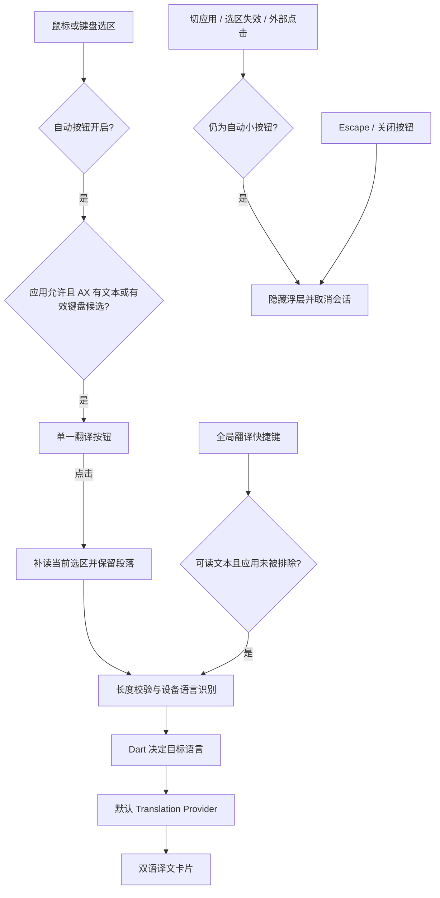

# Flutter macOS 架构

本文描述当前实现。规范性技术边界见[架构设计约束](specs/architecture.md)，产品行为与数值分别见[功能规格](specs/functional.md)、[样式规格](specs/style.md)。共享绘制样式与调色盘/粗细是Spec约束的待实施需求，本文不据此宣称已实现。

当前只交付 macOS 26+。Flutter/Dart 是应用与业务主体，Swift 负责 macOS 启动壳、系统能力和原生 Liquid Glass 材料。

## 常量与工具

通道名、方法名、UserDefaults 键、引擎入口名、错误码和状态机枚举只定义在 `lib/src/common/constants/` 与 `macos/Runner/Common/Constants.swift`。调用处引用常量。被两处及以上使用的无模块私有职责的方法放在 `lib/src/common/utils/` 与 `macos/Runner/Common/Utils.swift`。细则见 `docs/agents/coding-conventions.md`。

## 职责

| Flutter/Dart | Swift |
|---|---|
| Selection Session、翻译请求与取消、语言方向、Overlay 内容、设置状态与表单 | Accessibility、鼠标与键盘监听、Carbon 热键、窗口、设备语言识别、UserDefaults、Keychain 存取、登录项 |

主 Flutter 引擎持有唯一偏好与翻译会话。设置窗口按需使用第二引擎的 `settingsMain` 入口，表单通过 `translateapp/settings` 转发到主引擎。保存请求串行处理；修订号阻止旧表单覆盖菜单更新。

`main.dart`装配主引擎模块和跨窗口请求入口。`SettingsController`持有唯一设置快照、修订号与提交队列，通过`SettingsPlatform`提交系统偏好和凭据；`providerForSettings`选择翻译服务。`selection_translation_app.dart`处理选区事件、浮层交互和成功翻译的历史写入。`handleHistoryRequest`直接查询同一个SQLite存储，历史分页与记录开关不等待设置提交或服务测试。

设置模块接收初始配置、公开当前配置和发送提交通知时使用独立副本；协议快照复制可变排除项字典，外部草稿修改不能绕过提交队列。连接测试由设置模块内的独立流程处理，队列只等待其结果。采集启动、暂停、停止、取消和失败清理在异步等待后核对会话或分段资源身份；旧请求不清理新会话或恢复后的新流。

Swift附属窗口通过`MacPlatformBridge.routeWindowRequest`统一路由主引擎业务和系统能力；设置窗口只额外处理快捷键录制。截图窗口先验证捕获身份，再转发截图翻译；绘图偏好使用相同的主引擎设置队列。窗口不另建业务状态或复制通用转发表。

## 当前翻译流程

```mermaid
flowchart TD
    A[鼠标或键盘选区] --> B{自动按钮开启?}
    B -- 是 --> C{应用允许且 AX 有文本或有效键盘候选?}
    C -- 是 --> D[单一翻译按钮]
    D -- 点击 --> M[补读当前选区并保留段落]
    M --> F[长度校验与设备语言识别]
    E[全局翻译快捷键] --> G{可读文本且应用未被排除?}
    G -- 是 --> F
    F --> H[Dart 决定目标语言]
    H --> I[默认 Translation Provider]
    I --> J[双语译文卡片]
    K[切应用 / 选区失效 / 外部点击] --> N{仍为自动小按钮?}
    N -- 是 --> L[隐藏浮层并取消会话]
    O[Escape / 关闭按钮] --> L
```

## 窗口与会话

- 翻译窗口使用高于 floating 的 status-bar 层级，是不能成为 key/main 的非激活 NSPanel；触发态的按钮尺寸与命中窗口见样式Spec，呈现为单按钮，结果态为 720×420pt 左右双栏卡片，左译文、右原文，悬停译段时高亮对应原段。
- Flutter 区分点击和拖动；译文顶部 56pt 标题区支持拖动，关闭按钮和正文在拖动命中区之外。Swift 保存本窗口原始 mouseDown 事件，Flutter 确认 pan 后将原事件交给 AppKit performDrag。同一会话保留位置，显式新翻译重新锚定。
- Swift 保存来源 PID、sessionId 及结果保留标记。Dart 激活时先发送 `retainOverlay`，再补读文字并进入翻译；保留后忽略被动失效和自动新选区，只允许 Escape/× 关闭或全局热键明确替换。旧 sessionId 的指令不能影响新会话。
- 选区、失效事件和窗口命令携带 sessionId。系统设置命令不属于选区会话，使用独立方法和设置修订号。
- 「仅使用快捷键」开启表示 automatic=false；菜单与表单均反向显示底层自动捕获状态。自动捕获关闭时保留 Escape、外部点击和前台变化监听，使快捷键产生的会话仍能正常关闭。
- 全局热键使用 RegisterEventHotKey；同一组合不重复注册，新组合注册成功后才释放旧组合。

## 服务与凭据

自动采集只读取 AX，不向来源应用注入按键。鼠标采集需要 AX 文本；Command-A 和 Shift 键盘选区可创建待确认按钮。点击翻译后携带 sessionId 补读文字；补读为空则保留失败卡片，不发送请求。全局翻译快捷键直接翻译并允许复制；网页文本通过一次性复制保留段落，随后恢复剪贴板。显式关闭或替换后的迟到结果不能提交请求。

AX 读取优先使用文本标记范围获取跨节点选区，再读取普通选中文字和字符范围；接口返回文字与实际文字节点，浮层在读取完成时的鼠标位置旁显示。焦点窗口作为受限树查询的候选根，非文本或安全焦点控件不进入窗口搜索。

自动按钮跟踪实际提供选中文字的 AX 节点；通知合并后区分暂不可读和已确认清空。没有可读节点时不能确认键盘清空，按钮仍可通过外部点击、Escape 或切 App 结束。结果态不受这些被动验证影响，采集任务在读取前后均检查结果保留标记。

选区文本使用现有 `TranslationRequest` 进入翻译层。截图 OCR 和实时区域 OCR 按相同契约规划接入，由各入口管理采集与启停；翻译层不接收图片或录屏文件，不为尚未实施的入口建立空接口。

- 主 Dart 引擎串行处理设置保存、菜单修改和示例连接测试；修订号阻止过期表单覆盖。设置保存不关闭已展开卡片，已激活请求固定使用激活时的 Provider 和语言方向，更新供下一次翻译使用。
- `ServiceConfig` 保存服务类型、名称、Base URL、模型、独立提示词及语义对照选项；凭据独立传给 Swift，按配置 ID 存入用户 Keychain。
- 打开设置仅查询 Keychain 凭据存在状态，禁止查询触发授权 UI。保存普通配置不读取密钥；有凭据变更时 Swift 才读取对应账户的回滚快照。凭据、登录项与快捷键配置成功后才保存普通偏好；同一服务 ID 不可更换协议。
- 默认服务支持非官方 Google、Google Cloud v2、百度通用翻译、OpenAI-compatible Chat Completions、DeepSeek 与 Anthropic Messages。协议、百度签名、SSE 解析均由 Dart 实现。DeepSeek 类型及官方域名发送 `thinking.type=disabled`，段落模式另发送 `response_format.type=json_object`。
- 每个请求独占 HttpClient；取消关闭连接，请求不跟随重定向，失败信息不回显响应正文或密钥，也不自动切换服务。
- 模型段落对照一次接收全文上下文：本地按非空行分段并给出连续编号，模型仅返回各编号与完整译文。编号数量、顺序、整数类型和非空译文均需通过校验，再与本地原文配对；不使用模型回传的原文，不接受整篇高亮兜底。损坏 JSON、流中断和长度截断不算成功。
- 普通模型模式产生增量 Translation Update；语义模式在校验完成后一次发布译文和配对，避免向用户展示协议 JSON。
- Provider 使用共享的 `translateParagraphs` 保留原文分隔符并建立双语配对；普通接口顺序处理原文段落，语义模型保留整篇上下文。当前请求通过 `StreamIterator` 传播取消，失败或关闭后不处理后续段落。
- 次要语言为空时，方向仍解析为有效的主要语言；检测语言等于目标语言时，翻译层直接返回原文及段落配对。

## 后续工单

长文本失败片恢复由 #7 跟踪。

## 原生玻璃材料

`NativeGlassFactory` 在主引擎、设置引擎、截图引擎及辅助窗口引擎分别注册平台视图，创建 macOS 26+ 的 `NSGlassEffectView`。`NativeGlassSurface` 只把系统材料放在 Flutter 前景控件下面；材料不接受键盘焦点或拦截点击，复制/保存仍由独立文档渲染输出。各控制器明确使用透明 Flutter 背景，窗口层级和激活规则保持各自职责。

五类界面共用 `NativeGlassTheme`，跟随系统明暗和高对比度模式。弹窗成为活动材料层时，下层页面保留同一控件树和表单草稿，使用普通内容底色避免重复折射。正文和密集历史条目使用非折射内容区域。玻璃接入直接使用现有 Swift 系统桥，不增加第三方运行时依赖。

冻结截图的 Return 与小键盘 Enter 由本地路由及可消费的会话级事件拦截统一转发 `confirmScreenshot`，绑定当前 captureId；处理后的按键不再交给来源应用，避免同时提交来源表单或消息。文字输入与组词由 Dart 和原生输入法按状态处理，重复按键不会重复导出。长图结果只处理本窗口的按键，失焦后不拦截其他应用输入。缺少事件拦截权限时明确提示，不使用仅旁听的全局确认。原生反馈回路使用独立剪贴板验证失焦情况下的事件消费、PNG 像素和窗口关闭。

## 翻译历史实现

主 Dart 引擎持有 `TranslationHistoryStore`，SQLite 位于 Application Support。独立 Flutter `historyMain` 窗口通过原生通道请求数据，Swift 不存储历史。卡片标题为来源应用名称或「截图」和本地完成日期，内容按译文、原文排列。分页按 `(completed_at, id)` 倒序，每批 10 条；游标避免新记录插入导致重复分页，刷新从最新记录开始。

选区来源显示名在 Swift 捕获选区时随事件传入 Dart；成功记录使用激活时的服务和语言方向。截图由 `translateScreenshotText` 编排本地语言识别、分段翻译和写入；请求携带 captureId，网络请求前及完成后都核对原生截图身份。只有完整成功且未被取消的结果写入，每次独立保存，不去重。记录开关持久化于同一 SQLite，默认开启，关闭只阻止新写入。历史不存储图片、窗口坐标或密钥。

## 连续采集与本地媒体

截图编辑工具栏“截图”组通过截图通道把录屏与长截图交给 `CaptureWindowController`。录制目标与应用图标使用同工具栏动态行及独立按钮材料；开始按钮提交冻结帧身份、目标和选区像素坐标，长截图携带冻结帧身份和像素坐标直接开始。`captureMain` 使用独立Flutter引擎呈现四个独立气泡控制条和视频结果，通过 `translateapp/capture` 交换实际状态。`MediaCaptureService` 在主执行器管理会话ID、ScreenCaptureKit流与临时目录；暂停、结束、放弃与恢复均校验真实阶段和会话。采集期间暂停被动选区翻译并隐藏翻译浮层。

显示器、应用可见窗口与选区开始前重新校验。原生配置给出屏幕点坐标范围，`CaptureShadeView` 绘制穿透鼠标的实时边框和选区外阴影；采集与暂停都保持可见，所有控制窗口由捕获过滤器排除。区域和全屏通过 `SCRecordingOutput` 写入同会话MP4分段；应用通过每屏仅包含所选应用的 `SCStream` 采集，由 `ApplicationRecorder` 将每屏最新帧按桌面位置合成到固定联合画布，以最高显示倍率编码，其他区域填黑；暂停完成当前段、恢复追加下一段，结束按顺序无间隙合并并验证解码后交付。`GIFExporter` 从完整视频按截图设置中的帧率与最大宽度编码，在完整可读后由`ScreenshotStorage`原子发布到截图根目录/gif/YYYY-MM-DD，PNG与MP4分别使用截图、视频分类；重名追加序号，失败保留源媒体。

用户展开录制目标时准备隐藏的采集界面，开始采集直接复用该引擎。采集控制条为非激活的 status-bar 层级面板，可出现在其他应用的全屏空间。视频结果使用普通层级的带标题栏 NSWindow，提供红黄绿按钮；AppKit将系统边框计入等比媒体和右侧纵向工具栏的整体边界。切换阶段时新建对应类型的原生窗口并转移同一 Flutter 内容。准备态在视图缩放前立即通知Flutter，以便同步缩放取得新画面；媒体结果在原生几何更新后通知，确保结果布局拥有足够空间。系统关闭、工具栏关闭与键盘关闭复用同一立即放弃路径，清理临时资源并保留已保存文件，内部窗口切换不触发用户关闭逻辑。保存与GIF导出使用截图设置中的根目录，日期在操作开始时冻结，不弹路径确认。

录制启动通过系统日志 `subsystem=TranslateApp`、`category=CaptureStartup` 记录界面同步工作、来源配置、系统流资源创建、异步启动及实际开始写入的耗时；仅包含固定步骤名和毫秒时长，不包含截图、窗口标题或文件路径。

长截图通过串行 `SCScreenshotManager` 取得固定单屏选区，按100ms开始间隔采样，间隔包含采集和拼接耗时，不堆积并行请求；暂停不请求新帧并拒绝迟到帧。`ScrollStitcher` 先验证正文位移，再区分同位置固定像素与正文空白，自动排除上下固定带并合成首帧顶部与末帧底部。没有可信接缝就停止，已确认图像与原因留在采集会话并打开“长截图结果”窗口；先确认该窗口可见再撤下采集遮罩，关闭后才释放会话。结果窗口是普通层级，打开时盖过当前前台应用，失焦后不截获其他应用按键。正文配准允许整段一致的亚像素栅格化差异，输出保持原始条带像素；不降低接缝可靠性和歧义限制。控制与预览材料不进入像素。

## 区域截图

Swift 的系统截图模块用本进程 ScreenCaptureKit 申请屏幕录制并取得显示器冻结帧；未授权不进入编辑。Dart 的 `ScreenshotApp` 在冻结帧上框选（选区外变暗、选区内清晰），负责标注、自动文件名和导出。截图结果用独立 captureId 拒绝过期操作，不属于 Selection Session。

固定目录保存在 UserDefaults 的 `screenshotSaveDirectory`，只通过设置页修改。ScreenshotStorage 通过拒绝覆盖的实际写入和序号处理重名。翻译与截图热键由同一 Carbon 注册事务管理，已有组合交换用途时复用注册，全部新注册成功才更新配置。

区域框选时暂停文本手势采集并隐藏翻译浮层，完成后只恢复仍有效的浮层。截图的复制与保存不经过翻译层；OCR 及统一文本请求由 #20 后续实现。

## 视觉偏好与分片恢复

视觉设置与普通偏好一起由主 Dart 引擎提交；Swift 提交后通知每个 NativeGlassFactory，各独立引擎通过 appearance 通道只接收视觉快照。NativeGlassApp 重建主题并保留业务页面，NativeGlassSurface 使用单材料作用域防止嵌套折射。普通窗口由 NativeReadingCanvas 绘制贯穿标题与正文的 sRGB 阅读底色，NativeGlassWindowPage 使用同色且无内部圆角；contentLayoutGuide仅用于避让系统交互安全区。

TranslationProgress 只保存已完成分片、配对和上一片双尾；SelectionSession 持有冻结服务与方向，失败后通过 retry 重发失败片。翻译浮层仍消费统一 TranslationSnapshot，成功后的历史写入沿用主入口的完整结果边界。

### 设置自动保存

设置页对离散选择立即提交，对连续透明度调整在结束时提交。服务编辑器只在确认完整有效表单后提交配置与凭据。设置页保留当前草稿及编辑序号，通过现有主引擎版本事务串行保存；请求期间的后续编辑在上一事务完成后继续提交，旧回包和旧加载快照不覆盖最新草稿。失败保留编辑、显示重试，外部版本冲突要求显式重新加载。设置窗口使用正文之外的固定顶部导航、外置字段标题和共享连续圆角，控件材料不延伸到空白行。

正常保存不显示进度或成功文字，不改变页面高度。截图工具顺序、显隐与快捷键由 `ScreenshotToolbarPreferences` 校验完整顶层动作排列、冲突和保留组合，随普通偏好事务提交；Swift 只广播工具配置，截图引擎保留图像、选区和标注。非激活截图面板在原生会话按键路由匹配已保存组合，消费命中事件并派发携带captureId的语义动作；文字输入状态通知也绑定captureId。按钮与键盘共用动作映射，隐藏只影响按钮展示；上下文动作保持固定位置且不响应自定义快捷键。光标工具优先命中文字，再处理截图区域；两者共用八点、边线与内部移动命中规则，拖动只更新当前对象。

截图文字编辑状态通过 `screenshotTextInput` 同步到原生控制器；编辑期间普通字符、编辑快捷键和输入法回车交给 Flutter 文本系统。原生事件路由消费已处理的截图命令，不重放字符。贴图使用非激活面板并接收首次鼠标按下，在开始 AppKit 拖动前选中当前贴图，使 Escape 只关闭该贴图。

### macOS 对角拉伸光标

截图与文本框的命中规则由Dart统一计算。两种对角轴通过 `NativeResizeCursor` 的鼠标会话向当前截图引擎发送 `setResizeCursor`，AppKit使用 `NSCursor.frameResize(position:directions:)` 显示原生双向光标；轴为 `nwse` 或 `nesw`。水平、垂直、文本、移动和按钮光标继续由Flutter系统会话管理。离开区域由下一光标会话接管，关闭编辑器清除本会话原生光标，关闭后的迟到请求不生效。

## 绘制样式与来源身份

DrawingStyle是标注组合的不可变样式，颜色与线宽控件只返回已确认的值；文档沿用现有命令历史。原生采集在取得前台应用时冻结显示名，与原文会话一起发送，不在异步完成后按PID重新查询。

图形工具采用rect配置身份，四种图形和普通/马赛克画笔通过同一绘制方法服务预览与PNG导出；浮层选择框不进入像素。共享数值在common/constants/drawing_metrics.dart，控件在screenshot/drawing_controls.dart。

DrawingPreferences按工具保存颜色、线宽、形状与画笔模式，主Dart设置队列验证并写入screenshotDrawing偏好。历史SQLite插入成功通知原生转发historyChanged，窗口内按请求版本重载；主题内层Builder驱动完整历史列表样式重建。

绘图属性按具体图形模式、普通画笔与马赛克画笔隔离。DrawingPreferences.styleFor负责解析对应子工具的不可变样式；调整写入自己的variants槽，基础配置用于初始化未调整的子工具，不在子工具之间传播修改。
