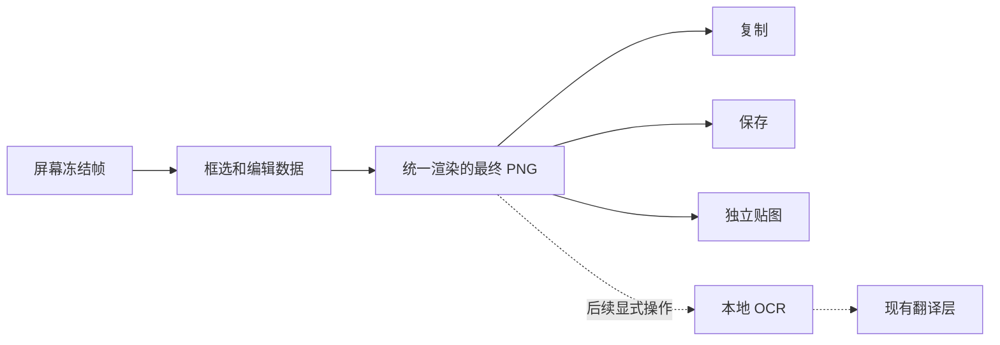

# 截图原地编辑与贴图设计

状态：设计方案，待确认交互细节；尚未实现。当前代码版本为 0.4.0。

Codex-Thread: 01a06fe3-df48-7fb0-983b-443d579db93e

## 目标与交互

1. 截图直接在桌面的冻结画面中框选，选区外变暗、选区内保持清晰。选区可移动、通过八个控制点调整；框选完成后工具栏贴近选区，接近屏幕边缘时换到能完整显示的位置。
2. 工具栏分两行：第一行为标注工具与撤销/重做、贴图、保存、复制、关闭；第二行只显示当前工具有意义的颜色、线宽、字号或颗粒大小。工具栏不进入最终图片。
3. 不创建居中的独立预览窗口。保存直接写入设置中的固定目录，成功只在工具栏附近反馈。目录选择、自动命名说明、截图快捷键归入设置页。
4. 建议默认目录为 `~/Pictures/TranslateApp`，首次实际保存时创建；用户可在设置中改为其他目录。重名追加序号，目录不可用时保留编辑结果并提示错误，不静默切换目录。
5. 双击未被文本输入或未完成折线占用的图片区域，复制编辑后的图片并结束本次截图。折线绘制中的双击只结束折线；文本编辑中的双击保留选字行为。这两个例外属于待确认设计。
6. Esc 关闭本次截图编辑并丢弃未导出的草稿；已保存/复制的结果保持有效。保存成功可继续编辑，复制完成和贴图完成结束本次截图。
7. 矩形/椭圆指图形标注，截图裁剪选区保持矩形。圆形裁剪不在本轮范围。

## 标注工具及属性

| 工具 | 行为 | 可调属性 |
| --- | --- | --- |
| 画笔 | 连续自由笔划 | 颜色、粗细 |
| 记号笔 | 半透明高亮，不遮住底下文字 | 颜色、粗细、透明度 |
| 矩形、椭圆 | 绘制标注框；按 Shift 约束正方形/圆形 | 描边颜色、粗细 |
| 折线 | 连续点击加点，完成后形成一条标注 | 颜色、粗细 |
| 箭头 | 拖动确定起终点，箭头尺寸随线宽 | 颜色、粗细 |
| 文本 | 点击输入，提交后可选中修改 | 颜色、字号 |
| 马赛克 | 对指定区域做像素化遮挡 | 作用范围、颗粒大小 |
| 橡皮擦 | 擦除标注层，不擦掉原始截图 | 擦除范围、大小 |

颜色属性用于产生颜色的工具。马赛克和橡皮擦不提供无实际意义的颜色按钮；如果用户所说的“改颜色”指纯色覆盖区域，应使用有填充色的遮挡矩形，是否加入由用户确认。

橡皮擦默认不清除马赛克，马赛克通过选中删除或撤销调整。预览与最终图片均按“原图 → 马赛克 → 普通标注”的顺序绘制；橡皮擦只作用于普通标注层。此默认擦除范围需用户确认。

## 模块与接口

| 模块 | 所有内容与职责 | 对外接口及约束 |
| --- | --- | --- |
| 系统截图模块，Swift | 权限、显示器冻结帧、无边框窗口容器、显示器坐标变换、结束时还原窗口状态 | 开始捕获返回 captureId、各屏冻结位图及坐标元数据；结束/cancel 释放本次资源。错误不改变剪贴板或文件 |
| 截图编辑模块，Dart | 框选状态、标注数据、选中对象、工具属性、未提交笔划/折线/文本、撤销重做 | 接收冻结帧；输入手势更新编辑数据；输出固定版本的最终 PNG。Swift 不处理画笔/文字等编辑规则 |
| 图像导出模块，沿用现有 Dart 流程和 Swift 系统能力 | 自动命名、保存、复制、组合操作和过期操作拒绝 | 只接收 captureId 与已经渲染的 PNG；各出口不能自行回读未编辑原图。复制并保存准确报告部分成功 |
| 贴图模块，Swift 窗口加图像显示 | 独立置顶图像、位置、缩放和关闭；允许多张贴图 | 接收最终 PNG 创建独立贴图；拖动、缩放、关闭只影响目标贴图，之后的编辑不改变已贴出的图片 |
| 设置模块，沿用 AppSettings/设置页 | 固定保存目录、自动命名规则、截图热键 | 目录选择先改表单草稿，与其他设置一起保存。截图编辑器消费已保存配置，不另存第二份目录配置 |

保持现有 Flutter/Dart 承担界面与业务的分工。原生截图窗口提供承载与系统能力，不把整个编辑器搬到 Swift；现有截图 Flutter 入口可以承担编辑层，独立普通预览的布局被移除。

## 采用的设计方式

1. **会话状态机**：`空闲 → 捕获中 → 框选 → 编辑 → 导出`。捕获失败或 Esc 结束当前会话；保存完成回到编辑；复制或贴图完成结束会话。未完成笔划、折线及文本属于当前编辑草稿，不混进已经提交的历史。
2. **不可变标注数据与轻量历史快照**：原始位图只保留一份。标注记录类型、几何、颜色、线宽或文字；已提交数据不可原地改写。一次笔划、一次形状拖动、一次文本提交或样式修改算一次历史操作。撤销/重做保存并共享标注数据，不复制整张截图，也不为每个鼠标移动创建历史记录。
3. **统一渲染入口**：画布预览和 PNG 导出使用同一绘制实现，依次处理裁剪、马赛克、标注及橡皮擦遮罩。导出只包含裁剪后的最终像素，不包含工具栏、选区控制点、未裁剪原图或可还原编辑数据。
4. **有限工具类型分发**：工具枚举决定手势处理和属性面板，共用几何及样式数据。无需一工具一套窗口，也不为这批已知工具建设插件框架、工厂层或全局事件总线。

## 坐标、输入与生命周期

1. 每屏保留显示器 ID、全局逻辑点矩形、真实位图尺寸和变换信息。原生负责 AppKit 坐标到窗口局部坐标；Dart 将手势位置转换为源图片像素坐标。标注、裁剪和导出都以图片像素为标准，缩放只改变显示变换，不能直接拿 Flutter 逻辑像素去裁剪 Retina 原图。
2. 不用主屏高度推算其他屏幕坐标。首阶段建议支持任意单块显示器内的选区；跨不同缩放率显示器的连续框选涉及合成分辨率，需另行确认后纳入验收，不默默降采样。
3. 进入截图前先取得屏幕图像，再显示选择/编辑层，避免工具栏和自身窗口进入抓屏。截图全程暂停文本选区翻译手势；退出时只恢复仍有效的译文会话。
4. 编辑层为了文本输入可以接收键盘焦点；结束后按仍在运行的来源应用还原焦点。它不复用不能成为 key/main 的翻译面板。贴图的点击与拖动避免激活来源之外的应用。
5. Esc 只关闭当前正在操作的编辑层或当前选中的贴图，不连带关闭其他贴图或译文。贴图还应提供明确关闭入口。截图与译文不能同时消费同一关闭动作。
6. 导出开始时固定 captureId 与文档版本；新截图或新编辑不能被旧异步导出结果覆盖。贴图接收不可变的最终图片，独立于截图编辑会话。

## 实施顺序与现有工单

1. **设置和原地编辑基础**：固定目录移入设置；取得屏幕冻结帧及坐标；无边框选区、可移动工具栏、基础复制/保存、双击和 Esc。涉及 #25、#27、#26；保留现有截图热键注册及文件不覆盖逻辑。
2. **标注与历史**：画笔、记号笔、矩形/椭圆、折线、箭头、文本、颜色/粗细/字号、选中修改、撤销重做，以及共享预览/导出渲染。扩展 #27。
3. **马赛克与橡皮擦**：实现图层顺序和擦除范围，验证最终 PNG，不把显示效果当作已经导出的遮挡。仍属 #27。
4. **贴到屏幕**：独立置顶、拖动、缩放、多张并存和定向关闭；只接收最终渲染图片。使用 #22。
5. **截图翻译**：上述图像链路稳定后，本地 OCR 消费用户最终可见的截图，再进入现有 TranslationRequest。仍使用 #20，不将 OCR、录屏或长截图塞进本轮编辑器实现。

#27 可以按这几步分别提交并记录验收，不另建重复的画笔/矩形等零散工单。每一阶段完成代码与自动检查后再交付用户实机验证。

## 验证要求

1. 使用合成图片进行像素级检查：裁剪准确、形状/文字/高亮输出一致、透明边缘无黑底；颜色和线宽变化能在导出中体现。
2. 马赛克后用橡皮擦经过同一区域，默认擦除规则下原始文字不会重新显现；导出的文件只含最终裁剪位图。
3. 一次拖绘只增加一条历史；撤销/重做、选中改色、文本修改后导出结果准确。开始新截图清空旧草稿与历史。
4. 双击在普通图片、折线绘制和文本输入中的作用各自验证；Esc、关闭、保存失败、复制失败和导出期间切换会话不交叉影响。
5. 用户实测普通屏/Retina、副屏、不同缩放率、多张贴图，以及退出编辑后的来源焦点、系统权限和翻译功能。遵守用户约定，由用户操作桌面完成这些验证。

## 事实依据与当前代码接缝

1. [Snipaste 官网](https://www.snipaste.com/) 明确列出矩形、椭圆、折线、箭头、画笔、记号笔、文本、马赛克与橡皮擦；官网的贴图交互包含双击隐藏。本文的双击复制与 Esc 退出按用户需求设计，不宣称完全照搬 Snipaste 的快捷操作。
2. `ScreenshotWindowController.capture()` 当前使用系统 `screencapture -i -s`，只拿到 PNG；`show()` 创建普通居中窗口。原地编辑需要能取得屏幕位置和冻结帧的捕获路径。
3. 现有 `ScreenshotApp._export()` 和 `ScreenshotStorage.save()` 可继续承担组合操作结果与文件不覆盖；导出输入需改为编辑后的 PNG。
4. 当前目录由截图预览直接写入独立 UserDefaults 字段；设置改版应统一配置入口与唯一存储来源，不维护两个互相覆盖的目录值。

## 待确认的默认行为

1. 双击复制后结束截图；正在绘制折线时双击结束折线，文字输入时双击选字；Esc 直接结束当前截图。
2. 橡皮擦只擦普通标注，马赛克用删除/撤销调整；马赛克调颗粒、橡皮擦调大小，不设颜色。
3. 首阶段允许在任意单屏内框选；是否必须一次跨两块显示器连续框选，需要用户确认。
